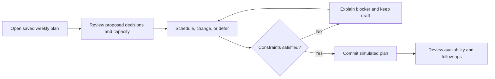

# Fleet Maintenance: Plan Review and Implementation Goals

> **Superseded as a plan.** Everything proposed here has been merged into
> [fleet-maintenance-work-packages.md](fleet-maintenance-work-packages.md), which is now the key build
> document. This file is retained as the reasoning trail: the findings below carry the evidence and the
> argument behind each change, which the work packages state as decisions rather than re-argue. Where the
> two disagree, the work packages win. Merged 23 September 2026.

Reviewed 23 September 2026 against the [challenge brief](product-builder-challenge-brief.md), [research and framing](fleet-maintenance-research-findings.md), and [work packages](fleet-maintenance-work-packages.md). All three were read in full, including the replacement research file. **Build timebox: 1–2 working days**, supplied during this review.

**Verdict:** the product direction aligns well with the brief. The primary user, weekly decision journey, explicit exclusions, and emphasis on consequences rather than dashboards are strong. The plan needs a tighter execution contract: the current cut line can remove essential behavior, some assumptions make a feasible plan impossible without an extra input, and completion criteria are mostly missing.

The recommendation is one complete weekly planning loop, demonstrated with a small number of contrasting decisions. This document proposes revisions to the locked scope; it does not silently change the source documents or claim the recommendations have been approved. No application implementation is included.

## 1. Alignment with the challenge

| Brief criterion | Assessment | Remaining gap |
| --- | --- | --- |
| Frame the problem and choose a primary user | **Strong.** The part-time Fuhrparkverantwortliche has a clear job and decision authority; research §§4–5 considers alternatives. | Carry that concise framing into the build plan, and resolve the spending-authority inconsistency below. |
| Choose what to build | **Strong direction, too much depth for the timebox.** Consequence of waiting plus weekly capacity answer the brief directly. | Nine packages, two entry points, ingestion, bundling, and dispatch behavior compete for 1–2 days. |
| Deliberately leave things out | **Strong.** Driver app, garage portal, procurement, ML, and multi-depot are explicitly excluded. | Cutting a feature must not remove the minimum behavior needed to finish the chosen journey. |
| Order the experience | **Partial.** Calendar first, then interruption, is well motivated. | Define the first screen's hierarchy and resolve calendar/list/detail behavior before building E2. |
| Explain what deserves attention | **Strong intent, unresolved mechanism.** Pre-proposed actions and explanations help. | Exact urgency in days/km and future failure costs need an evidence and uncertainty contract. |
| Control exposed complexity | **Partial.** One room and one primary user are good constraints. | Specify what appears immediately and what is revealed on demand; do not expose every domain object at once. |
| Support decisions rather than information | **Strongest part of the concept.** Act/wait, capacity, and garage constraints create meaningful choices. | Thin deferral records and bookability cannot remain optional if those actions are offered. |
| Deliver a usable, coherent product | **Partial.** Skeleton-first is the right build strategy. | Define commit, blocked plans, saved state, and a visible outcome; add observable completion gates. |
| Explain decisions, alternatives, and next steps | **Strong rationale already exists.** Candidate scopes and rejected personas are documented. | Turn them into a short walkthrough; distinguish assumptions and research claims from validated outcomes. |

The brief does not rank its criteria, require market novelty, or require an interruption workflow. The work packages' claim that coherence is scored “arguably hardest” is an interpretation. A complete weekly planning journey can demonstrate coherence by itself.

## 2. Findings, in implementation priority order

### P1 — Capacity needs a real route to a feasible plan

**Evidence:** [research A1/A3/A4](fleet-maintenance-research-findings.md#2-locked-scenario-assumptions) combines no reserve vehicles, committed demand, and partial route interchangeability. [E4](fleet-maintenance-work-packages.md#e4--capacity-ceiling) suggests moving bookings between days; E8 suggests route reassignment.

**Gap:** under the stated condition that every unavailable van loses a route, staggering alone cannot restore capacity. Reassigning routes does not create another van. An aggregate count can also appear healthy while the only compatible specialist vehicle is unavailable.

**Resolve before E4:** include fixed, confirmed rental cover as a mocked input, as A1 already permits, and calculate demand/availability by a small number of vehicle classes. No rental procurement or route optimizer is needed. Alternatively, revise A1 to allow lower-demand maintenance windows, but make that an explicit scope change. Include both a solvable conflict and a genuinely blocked plan. Planned downtime is not automatically free under this scenario.

### P1 — The cut line contradicts the locked journey

**Evidence:** [research §8.4](fleet-maintenance-research-findings.md#84-locked-scope) includes slot/parts before commit and first-class deferral. [The package cut line](fleet-maintenance-work-packages.md#8-scope-and-cut-line) makes E5 optional, E6 SHOULD, and most outputs NICE. E0 requires a safety-class fixture while enforcement is assigned to optional E7.4.

**Gap:** the minimum build could offer defer without follow-up, commit an unbookable visit, or apply different safety rules depending on entry path.

**Resolve before M1:** make thin slot/duration/parts constraints, deferral rationale/date/trigger, a committed-plan summary, and shared hard-stop enforcement mandatory. Reduce their breadth. The interruption UI may be optional; the rule that a fixture's known safety-class vehicle is unavailable must apply from cold open. The vehicle remains unavailable even when a planning draft is blocked.

### P1 — Urgency and consequence need an evidence contract

**Evidence:** [E1](fleet-maintenance-work-packages.md#e1--signal-to-item) specifies time-to-problem in days and kilometres; [E3](fleet-maintenance-work-packages.md#e3--consequence-of-waiting) promises future trajectories and failure risk. [Research §9](fleet-maintenance-research-findings.md#9-open-design-questions-for-the-build) leaves their basis unresolved, while predictive modelling is excluded.

**Gap:** transparent heuristics can still give false precision. A due date is different from a predicted failure date, and a raw fault code alone does not explain a safe waiting window.

**Resolve before deepening E3:** every recommendation identifies its observation/source, relevant date, assumption, proposed action, and consequence of waiting. Show a deadline or decision window only where the fixture supplies a basis; otherwise use qualitative uncertainty and an assessment action. Label synthetic costs and outcomes. Separate service cost, replacement cover, and operational disruption; reconcile the “near zero” planned-downtime claim with A1.

### P1 — Commit and persistence are contradictory or undefined

**Evidence:** [research Stage 0](fleet-maintenance-research-findings.md#stage-0--between-sessions-standing-state) and §8.4 require state between sessions; [E0](fleet-maintenance-work-packages.md#e0--foundation-and-mocked-world--substrate) excludes it. [E2.4](fleet-maintenance-work-packages.md#e2--the-plan-surface--walking-skeleton) says “fix the plan, generate outputs,” without defining success or recovery. E8.1 describes a booking request, not a confirmation.

**Gap:** it is unclear what survives refresh, how a deferred item returns, whether a booking is confirmed, or what remains after a failed commit. A planning commitment could be mistaken for a completed external booking.

**Resolve before M1:** use browser-local saved state for this prototype, a fixed demo clock, and reset. Define draft → validation → committed snapshot → edit/recommit. Model selected mock slots as explicitly guaranteed/confirmed by the fixture on successful commit; label the simulation. If bookings remain requests instead, the summary must say pending and cannot promise confirmed availability. Choose one contract, not both.

### P2 — Spending authority changes across the documents

**Evidence:** [research A7](fleet-maintenance-research-findings.md#2-locked-scenario-assumptions) and [the primary persona](fleet-maintenance-research-findings.md#41-primary-fuhrparkverantwortliche) limit the user's authority to a threshold. Research §5.3 calls an MD approval surface operationally necessary. Yet [§8.4](fleet-maintenance-research-findings.md#84-locked-scope) and [the work-package non-goals](fleet-maintenance-work-packages.md#10-non-goals) cut approval because the user is the budget holder.

**Gap:** the chosen persona does not have unconditional approval authority.

**Resolve in the fixture:** keep all demonstrated actions, including replacement cover, within delegated authority or already approved. State that above-threshold approval is outside this prototype. Retain A7 and the deliberate omission without inventing an approval workflow for the challenge.

### P2 — Shared behavior is missing from the dependency map

**Evidence:** [the dependency section](fleet-maintenance-work-packages.md#4-shared-behaviour-and-state-model) calls E3–E6 and E8 independent once E2 exists. [The build order](fleet-maintenance-work-packages.md#63-build-order) places demo hardening last.

**Gap:** visit duration/bundling changes capacity; deferral changes the queue and explanations; outputs depend on committed decisions. Separate feature models would diverge. The build also risks discovering an unusable walkthrough late.

**Resolve before M1:** agree stable item/vehicle/visit IDs and one draft/committed state model. Establish the walkthrough and reset immediately, then build through state, logic, and UI. A thin interruption needs a baseline plus one event, not necessarily deeply implemented E3–E6; nevertheless, defer it under this timebox until the main loop passes.

### P2 — The evidence and fixture can overstate the case

**Evidence:** [research source notes](fleet-maintenance-research-findings.md#10-source-notes) name organizations and reports but lack direct claim-to-source links for many precise statistics. The notes appropriately acknowledge zero-spare, population, and US-to-Germany limitations. [E0](fleet-maintenance-work-packages.md#e0--foundation-and-mocked-world--substrate) requires a deferral that turns out badly but no justified successful deferral. A5 treats raw/noisy data as permitted by the brief, not something the brief actually requires.

**Gap:** “research complete” is stronger than the traceable evidence supports. Precise failure/cost claims, competitor gaps, and the inference that defect-free reports imply rubber-stamping need substantiation. A failure-heavy fixture can teach “always intervene,” contrary to avoiding unnecessary maintenance.

**Resolve for the demo:** include one defensible deferral as well as an intervention. Mock normalized items with inspectable raw evidence instead of building a general ingestion pipeline. Add direct sources, dates, and applicability to claims retained in the presentation; omit unsupported precision. This review has not independently fact-checked market or legal claims, and treats the safety-class behavior as a chosen prototype rule.

### P2 — Feature completion has no consistent acceptance standard

**Evidence:** only E1 and E4 have explicit definitions of done; E4's is subjective. [The open items](fleet-maintenance-work-packages.md#11-open-items) leave time unknown, now resolved to 1–2 working days.

**Gap:** the team could finish package labels while leaving the chosen journey unusable. Launch, refresh, no-feasible-plan behavior, independent walkthrough, and evaluation handoff are unspecified.

**Resolve:** use G1–G6 and the gates below. Record checks as passed/failed/not run. An unobserved usability target is not a passed check, and prototype outcomes do not establish real-world reductions in cost or breakdowns.

## 3. Recommended implementation contract

**User:** retain the part-time Fuhrparkverantwortliche for one depot and approximately 45 vans, with authority to remove a vehicle and approve the seeded decisions.

**Problem:** decide what to service this week and what can reasonably wait while understanding the effect on committed work.

**Product promise:** “Make this week's maintenance plan, understand the trade-offs, and leave nothing deferred without a reason and follow-up.”

**First screen:** decisions needing attention alongside a compact week-capacity view. Item detail reveals evidence, explanation, slot alternatives, and deferral controls. Raw signals, cost detail, and other personas do not become separate primary screens.

The daily confirmation is a read-only output of this plan. An interruption, if built, opens the same surface with the change highlighted. This is a proposed reduction of research §8.4's two-entry, full-depth scope for the selected timebox.

## 4. Deliberate goals and definitions of done

These targets are proposed for the build; none has been tested yet.

| Goal | Observable completion criterion | Packages |
| --- | --- | --- |
| **G1 — Make attention understandable** | From reset, an unfamiliar user identifies the highest-priority unresolved item and explains why within one minute. The screen represents the ~45-van fleet without requiring review of 45 rows. | Thin E0/E1/E2 |
| **G2 — Support acting and waiting** | The walkthrough includes a warranted intervention and a warranted deferral. Both expose observation, recommendation, consequence, and uncertainty; no unsupported precise failure prediction is needed. | E3 + thin E6 |
| **G3 — Keep choices feasible** | Moving a visit recalculates capacity by day/class. Garage, duration, parts, and confirmed-cover constraints are checked. A hard-stop vehicle stays unavailable; a blocked plan cannot produce a success state. | E2/E4 + thin E5 + shared E7.4 |
| **G4 — Preserve the decision** | Defer records rationale, date, and trigger. Saved state survives reload; advancing to the review date or firing the trigger resurfaces the item with its history. | Thin E6 + E1/E0 |
| **G5 — Finish the primary journey** | In roughly five minutes, the evaluator can inspect, change, defer, resolve a seeded conflict, and commit. The summary contains visits, forward availability, cover assumptions, and deferred follow-ups. Recommit creates no duplicate visits. | E2 + thin E8 |
| **G6 — Deliver a repeatable prototype** | A fresh launch, saved-state reload, reset, and two complete walkthroughs behave consistently. The handoff gives the launch path, simulated integrations, limitations, decisions, alternatives, and next step. | E0.3 + delivery |

G1 and G5 require a usability walkthrough, preferably with a colleague unfamiliar with the build. Label a self-run walkthrough accurately. G2–G4/G6 also need deterministic scenario checks. The acceptance artifact should record each goal's result and any remaining limitation, not simply mark a package “done.”

## 5. Scope for 1–2 working days

**Mandatory, thin:** one user/depot/week; ~45 seeded vehicles; a small decision queue; evidence-backed explanations; schedule/change/defer; class-aware capacity; a few mocked guaranteed slots and parts-ready dates; fixed confirmed replacement cover; shared safety holds; local saved state; commit/summary; date advance/reset.

**Defer until the core passes:** richer bundle/split comparisons, interactive daily dispatch, a separate interruption entry, multiple event types, general signal processing, detailed future-cost modelling, generated messages, and expanded garage choice. Driver/garage apps, real bookings, route optimization, ML, procurement, and production compliance records remain outside the prototype.

**Example seed, deliberately synthetic:** 45 owned vans serve 45 daily vehicle assignments, divided into standard and specialist classes. One standard van is already held out of service, with one confirmed rental covering it all week. One additional standard rental is available on Tuesday and Thursday. Two standard maintenance visits on Tuesday leave one assignment uncovered; moving one visit to Thursday removes that conflict. A separate routine item has evidence supporting deferral. Keep specialist demand visible so an ordinary replacement cannot mask a specialist shortage. Existing cover is preapproved; no rental-purchasing UI is added.

Use whole-day periods and a few compatible slots. Multi-day visits use the same period arithmetic; no hour-level scheduling or routing engine is necessary. The safety-held vehicle remains unavailable until the fixture explicitly records release; a booking alone does not release it.

| Gate | Work and expected evidence | Timing constraint |
| --- | --- | --- |
| **M0 — Fix the contract** | Put G1–G6 next to the seed, choose the familiar implementation stack, and lock one-screen/detail behavior, local persistence, guaranteed mock slots, and the demo narrative. Resolve A1/A4/A7 semantics. | First focused setup block; cap design discussion at about 45 minutes. |
| **M1 — Finish the thin loop** | Seed → inspect → schedule/defer → validate → commit → summary → reload/reset. Include basic capacity, safety, slot, and deferral rules from the start. | First major build block on day 1. Demonstrate the loop before adding depth. |
| **M2 — Prove the choice** | Improve consequence explanations and reactive capacity. Demonstrate acting, waiting, solving a conflict, and a blocked alternative. Add review-date/trigger resurfacing. | Remaining implementation time on day 1; reach a complete, small version before extension work. |
| **M3 — Validate and hand over** | Run focused checks and the walkthrough; fix state/navigation problems; document launch and decisions. | Reserve the final quarter of whichever timebox is used: roughly 2 hours of an 8-hour day or 4 hours of two 8-hour days. These are planning allocations, not effort guarantees. |
| **M4 — Extend only after G1–G6 pass** | If a second day is available, improve unclear explanations first, then add one interruption as a change to the same plan or one bundle/split comparison. | Keep the final validation block protected; optional scope does not consume it. |

If progress slips, reduce fixture breadth, comparison depth, and optional controls. Preserve the full loop, safety/feasibility rules, deferral record, saved state, and committed outcome. Do not build the nine packages at equal depth.

## 6. Shared behavior to decide before implementation

- **State:** stable IDs for vehicles, items, evidence, decisions, visits, confirmed cover, and daily demand; one draft and one committed snapshot. Preserve the proposal separately from the user's choice and rationale.
- **Capacity:** per day and vehicle class, available = owned fleet minus distinct unavailable owned vehicles plus confirmed compatible replacement vehicles. Compare with demand of that class. Existing outages, holds, and visits count; overlapping reasons never subtract a vehicle twice. Tentative rental availability is not confirmed cover.
- **Urgency:** distinguish a known deadline from an estimate and unknown condition. Never infer a safety release from a lower-cost route or a scheduled appointment. The fixture supplies the evidence behind its classification.
- **Deferral:** a reason, review date, and trigger are required; the date arriving or the trigger firing brings the item back. Its prior decision remains visible. Watch is not an option for a known hard-stop item.
- **Commit:** successful mock commitment requires valid visits, feasible capacity, and a disposition for every required decision. A held vehicle can remain held with cover and a recorded next step; repair completion is not required to commit the rest of the plan. Uncovered shortages, impossible slots, and undisposed required items keep the draft blocked with a reason.
- **Booking meaning:** the fixture guarantees the selected mock slots and confirms them atomically with the plan. The UI labels the simulation; no external booking or message is sent. Real-world rejection/pending confirmation is future work.
- **Edit and recovery:** repeated commit does not duplicate visits. Editing leaves the last committed snapshot intact until recommit. Operational holds always override older availability claims. Refresh restores browser-local state; reset restores the deterministic seed and demo date.
- **Authority and units:** seed approved/below-threshold spend, consistently use EUR/km and an explicit simulated calendar, and label scenario prices. Do not mix source USD/mile statistics into displayed German operating estimates as if directly equivalent.

These are implementation notes, not a separate architecture project. Use one client-side application with fixtures and browser storage unless an existing scaffold makes another approach simpler; the challenge does not require a backend.
## 7. Verification scenarios

| Scenario | Pass condition |
| --- | --- |
| Known safety-class issue on cold open | Vehicle is unavailable before any plan commit; defer/watch is disabled with a reason. This works without interruption UI. |
| Justified routine deferral | Reason/date/trigger are recorded and service is not forced merely to clear the queue. |
| Tight day with a feasible alternative | Moving one visit to compatible confirmed cover changes the shortage and enables commit. |
| Aggregate capacity hides a specialist gap | Per-class validation still flags the shortfall; standard rental cover does not erase it. |
| Multi-day visit overlaps an existing hold | Every affected day is counted, each vehicle only once. An appointment does not imply release of a hold. |
| Slot or part is unavailable | Selection cannot become a confirmed visit; an alternative or explicit blocker is shown. |
| Evidence is insufficient | An assessment-needed state replaces an invented safe waiting period. |
| Review date or trigger occurs | The item resurfaces with the earlier decision and rationale intact. |
| No feasible plan exists | Draft remains recoverable, the shortage is visible, and the UI does not claim readiness. |
| Commit/edit/recommit/reload/reset | Summary matches committed decisions, no duplicates appear, and saved/reset state follows the contract. |

Use focused tests for capacity arithmetic, safety holds, deferral triggers, and commit consistency, plus the complete walkthrough. These verify the product promise; a large component-test suite is unnecessary for this timebox. No runtime tests were run as part of this documentation review because the workspace contains no application yet.

## 8. Changes to apply to the source plan

1. Add the selected 1–2 day timebox and concise persona/problem/promise to the work packages.
2. Update research §8.4 and the package cut line together: one complete weekly journey; interruption and richer bundling become extensions; thin E5/E6/E8 and shared safety behavior are required.
3. Resolve A1/A4 with confirmed replacement cover and class-aware capacity, and A7 with preapproved/below-threshold fixture spend.
4. Resolve the persistence contradiction in favor of local saved state; define commit, draft recovery, and simulated booking confirmation.
5. Replace precision without evidence with the recommendation contract. Add a legitimate deferral and an explicit no-feasible-plan scenario.
6. Replace the independence claim with the shared-state relationships, and add G1–G6 plus build/validation gates.
7. Add direct attribution for presentation claims and preserve the research caveats. Keep user-benefit validation separate from market positioning and hypothetical ROI.

The original research and work-package documents are preserved for comparison. This review is the proposed implementation baseline; reconciling those source documents is the next planning edit before coding.
