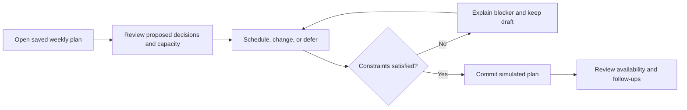
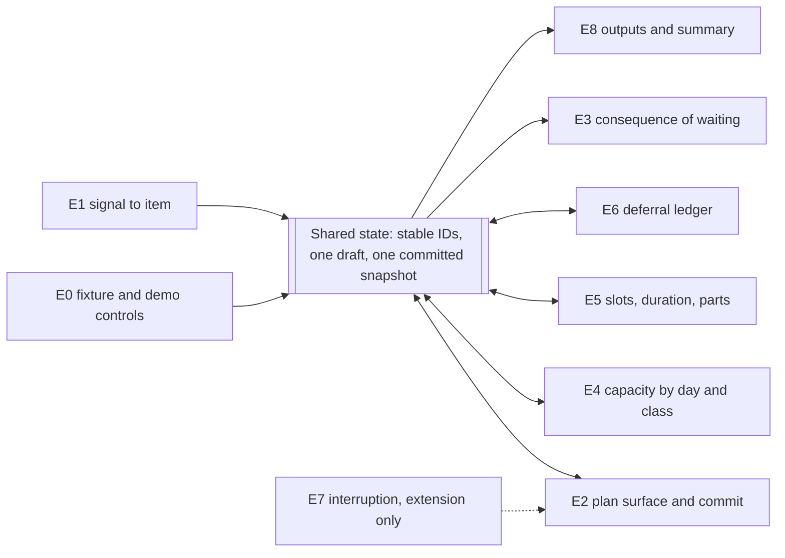

# Fleet Maintenance Prototype: Build Contract and Work Packages

The key build document for the MARKT-PILOT Product Builder Challenge (Fleet Maintenance).
It carries the scope, the goals, the shared rules and the work breakdown. Build from this file.

`fleet-maintenance-plan-review.md` is retained as the reasoning trail and the evidence behind each
decision recorded here; it is no longer the live plan. Research and framing stay in
`fleet-maintenance-research-findings.md`, referenced throughout as **[F §n]**. Where this document and
**[F §8.4]** disagree, this document wins, and the divergence is stated at the point it occurs.

**Status of the decisions below.** They are settled for the purpose of building and are written as
instructions rather than proposals. None has been user-tested. A working prototype demonstrates that
the journey holds together; it does not establish any real-world reduction in cost or breakdowns.

**Reference convention.** A bare section reference such as §4 points inside this document. A reference inside **[F ...]** points into the research findings.

**Build timebox: 1 to 2 working days.**

---

## 1. The build contract

**User.** The part-time Fuhrparkverantwortliche at one depot of roughly 45 vans **[F §4.1]**. Fleet is a
fraction of the job. Carries personal liability under UVV **[F §1.7]**, and has the authority to remove
a vehicle from service. Every action the seeded scenario asks for sits inside delegated authority or is
already approved; above-threshold spend **[F A7]** stays outside the prototype and is not replaced by an
invented approval workflow.

**Problem.** Decide what to service this week and what can reasonably wait, while seeing what that
decision does to work already committed.

**Promise.** *Make this week's maintenance plan, understand the trade-offs, and leave nothing deferred
without a reason and a follow-up.*

**First screen.** Decisions needing attention, next to a compact week-capacity view. Item detail reveals
evidence, explanation, slot alternatives and deferral controls on demand. Raw signals, cost breakdowns
and other personas do not get primary screens of their own.

**The loop:**

**One entry, one journey.** The weekly ritual is the only entry point that gets built. The daily
confirmation is a read-only output of the committed plan. The interruption (E7) is an extension: if it
is built, it opens this same surface with the change highlighted, never a parallel workflow. This is a
deliberate reduction of the two-entry scope locked in **[F §8.4]**, made to fit the timebox, and the
full journey including the return path is still walked through verbally if E7 is not built.

---

## 2. Goals and definitions of done

Six goals. A package marked "done" satisfies nothing on its own; these are what the build is judged
against, and the acceptance artefact records each one as **passed / failed / not run** with any
remaining limitation stated.

| Goal | Observable completion criterion | Packages |
| --- | --- | --- |
| **G1. Make attention understandable** | From reset, a user unfamiliar with the build identifies the highest-priority unresolved item and explains why, inside one minute. The screen represents the ~45-van fleet without making anyone read 45 rows. | thin E0 / E1 / E2 |
| **G2. Support acting and waiting** | The walkthrough contains one warranted intervention *and* one warranted deferral. Both expose observation, recommendation, consequence and uncertainty. Neither depends on a precise failure prediction the evidence cannot support. | E3 + thin E6 |
| **G3. Keep choices feasible** | Moving a visit recalculates capacity by day and by vehicle class. Garage slot, visit duration, parts and confirmed-cover constraints are all checked. A hard-stop vehicle stays unavailable. A blocked plan cannot reach a success state. | E2 / E4 + thin E5 + shared E7.4 |
| **G4. Preserve the decision** | Deferring records rationale, review date and trigger. Saved state survives reload. Advancing to the review date or firing the trigger resurfaces the item with its history intact. | thin E6 + E1 / E0 |
| **G5. Finish the primary journey** | In roughly five minutes an evaluator can inspect, change, defer, resolve a seeded conflict and commit. The summary carries visits, forward availability, cover assumptions and deferred follow-ups. Recommitting creates no duplicate visits. | E2 + thin E8 |
| **G6. Deliver a repeatable prototype** | Fresh launch, saved-state reload, reset and two consecutive walkthroughs all behave consistently. The handoff states the launch path, the simulated integrations, the limitations, the decisions taken, the alternatives rejected and the next step. | E0.3 + delivery |

**How they are checked.** G1 and G5 need a usability walkthrough, preferably with a colleague who has
not seen the build. A self-run walkthrough is recorded as a self-run walkthrough, not as an observed
one. G2, G3, G4 and G6 need deterministic scenario checks (§9). An unobserved usability target is never
a passed check.

---

## 3. Timebox and gates

One to two working days. The gates below replace the old pass structure in §6.3; they are ordered by
what must be true before the next block of work starts, not by package number.

| Gate | Work and expected evidence | Timing |
| --- | --- | --- |
| **M0. Fix the contract** | Put G1 to G6 next to the seed (§5), choose the familiar implementation stack, lock one-screen-plus-detail behaviour, local persistence, guaranteed mock slots and the demo narrative. Resolve the A1 / A4 / A7 semantics per §4 and §5. | First focused setup block. Cap design discussion at about 45 minutes. |
| **M1. Finish the thin loop** | Seed to inspect to schedule or defer to validate to commit to summary to reload and reset. Basic capacity, safety, slot and deferral rules are in from the start, not retrofitted. | First major build block on day 1. Demonstrate the loop before adding any depth. |
| **M2. Prove the choice** | Deepen consequence explanations and reactive capacity. Demonstrate acting, waiting, resolving a conflict and hitting a blocked alternative. Add review-date and trigger resurfacing. | Remaining implementation time on day 1. Reach a complete small version before any extension work. |
| **M3. Validate and hand over** | Run the §9 scenario checks and the walkthrough, fix state and navigation defects, document launch path and decisions. | Reserve the final quarter of whichever timebox is used: roughly 2 hours of an 8-hour day, or 4 hours across two. These are planning allocations, not effort guarantees. |
| **M4. Extend, only once G1 to G6 pass** | If a second day exists: improve unclear explanations first, then add *either* one interruption expressed as a change to the same plan *or* one bundle-versus-split comparison. | The M3 validation block stays protected. Optional scope never eats it. |

**If progress slips**, reduce fixture breadth, comparison depth and optional controls. Preserve the full
loop, the safety and feasibility rules, the deferral record, saved state and the committed outcome. Do
not build nine packages at equal depth.

---

## 4. Shared behaviour and state model

**The packages are not independent.** Visit duration and bundling (E5) change capacity (E4). Deferral
(E6) changes the queue (E1) and the explanations (E3). Outputs (E8) are a projection of committed
decisions, not a second store. E7, if built, is a change to an existing plan rather than a second plan.
Built as separate feature models these diverge, and the divergence surfaces late, during the
walkthrough. So the state model below is agreed at M0 and exists before M1, not after.

**State.** Stable IDs for vehicles, items, evidence, decisions, visits, confirmed cover and daily
demand. Exactly one draft and one committed snapshot. The system's proposal is stored separately from
the user's choice and rationale, so neither overwrites the other.

**Capacity.** Calculated per day *and* per vehicle class: available equals owned fleet, minus distinct
unavailable owned vehicles, plus confirmed compatible replacement vehicles, compared against demand of
that class. Existing outages, safety holds and scheduled visits all count; overlapping reasons never
subtract the same vehicle twice. Tentative rental availability is not confirmed cover. An aggregate
count that looks healthy while the only compatible specialist vehicle is unavailable is a bug, not a
rounding difference. This is the resolution of **[F A1 / A4]**; the fixture that makes it solvable is
in §5.

**Urgency.** A known deadline, an estimate, and an unknown condition are three different states and are
displayed as three different things. A safety release is never inferred from a cheaper route or from a
booked appointment. The fixture supplies the evidence behind every classification; where it supplies
none, the item reads *assessment needed* rather than being given an invented safe waiting period.

**Recommendation contract.** Every recommendation names its observation and source, the relevant date,
the assumption in play, the proposed action, and the consequence of waiting. A deadline or decision
window appears only where the fixture supplies a basis for one; otherwise the uncertainty is
qualitative and the action is to assess. Synthetic costs and outcomes are labelled as synthetic.
Service cost, replacement cover and operational disruption are three separate numbers, never one blended
figure.

**Deferral.** Reason, review date and trigger are all required. The date arriving or the trigger firing
returns the item with its prior decision visible. *Watch* is not offered for a known hard-stop item.

**Commit.** A successful mock commit requires valid visits, feasible capacity, and a disposition for
every required decision. A held vehicle may stay held provided cover and a recorded next step exist;
completing the repair is not a precondition for committing the rest of the plan. Uncovered shortages,
impossible slots and undisposed required items keep the draft blocked, with the blocker named.

**Booking meaning.** The fixture guarantees the selected mock slots and confirms them atomically with
the plan. The UI labels the simulation. Nothing is sent anywhere. This document picks guaranteed-and-
labelled over pending-request; whichever is chosen, the summary language matches it, and a planning
commitment is never presented as a completed external booking. Real-world rejection and pending
confirmation are future work.

**Edit and recovery.** Repeated commit does not duplicate visits. Editing leaves the last committed
snapshot intact until recommit. Operational holds always override older availability claims. Refresh
restores browser-local state; reset restores the deterministic seed and the demo date.

**Persistence.** Browser-local saved state, a fixed demo clock and a reset control. The lifecycle is
draft, then validation, then committed snapshot, then edit and recommit. This resolves the contradiction
between **[F Stage 0]** and **[F §8.4]**, which require state between sessions, and E0's original
exclusion of it: the exclusion is withdrawn.

**Authority and units.** Seeded spend is approved or below threshold **[F A7]**. EUR and km throughout,
on an explicit simulated calendar. Scenario prices are labelled as scenario prices. Source statistics in
USD per mile are not mixed into displayed German operating estimates as though they were equivalent.

These are implementation notes, not a separate architecture project. One client-side application with
fixtures and browser storage, unless an existing scaffold makes something else simpler. The challenge
does not require a backend.

---

## 5. Seed scenario

Deliberately synthetic and labelled as such in the UI. It exists to make three things demonstrable: a
conflict with a real solution, a conflict with no solution, and a deferral that is defensible rather
than negligent. Arithmetic is whole-day; there is no hour-level scheduling and no routing engine.

**The fleet.** 45 owned vans at one depot serving 45 daily vehicle assignments, so there is no slack by
construction **[F A1]**. 38 standard, 7 specialist. Demand is 38 standard and 7 specialist per weekday.

**Cover.** `R-1`, one standard rental, confirmed for the whole week. `R-2`, one further standard rental,
confirmed for Tuesday and Thursday only. Both are pre-approved and below threshold **[F A7]**; no
rental-purchasing UI exists. No specialist rental cover is available at any point in the week. Cover
cost appears as a labelled scenario price.

**The decisions on the queue.**

| Item | Vehicle | Class | Character |
| --- | --- | --- | --- |
| Brake defect found at UVV inspection | `V-012` | standard | **Safety class, hard stop.** Already held out of service at cold open, covered by `R-1` all week. Defer and watch are unavailable. Stays unavailable until the fixture records an explicit release; booking a visit does not release it |
| Front suspension wear, contradicting the odometer interval | `V-103` | standard | Act now. Scheduled Tuesday. Scope can extend to a second day, which is the seeded garage-scope-change event |
| Service interval approaching | `V-118` | standard | Act now or move. Scheduled Tuesday, movable to Thursday |
| Intermittent fault code, cleared twice | `V-041` | **specialist** | Needs a visit. Any specialist visit this week leaves a specialist assignment uncovered, and no specialist cover exists |
| Wiper linkage noise reported by driver | `V-027` | standard | **The defensible deferral.** Recent inspection clean, low weekly mileage, next scheduled service in five weeks. Evidence supports waiting |

**The solvable conflict.** `V-012` is already held, so its Tuesday visit subtracts nothing further; this
is the check that overlapping reasons never remove a vehicle twice. `V-103` and `V-118` are both in
service, so Tuesday standard availability is 38 owned, minus 1 held, minus 2 in for service, plus `R-1`
and `R-2`, which is 37 against demand of 38. One assignment is uncovered. Moving `V-118` to Thursday
clears it: Tuesday returns to 38, and Thursday is 38 owned, minus 1 held, minus 1 in for service, plus
`R-1` and `R-2`, which is 38. The week commits.

**The unsolvable one.** `V-041` is specialist. Standard rental cover does not substitute, so scheduling
it this week produces a specialist shortfall that no available lever closes. The aggregate count looks
healthy throughout. This is the demonstration that per-class validation is not a refinement, and the
demonstration of a blocked plan that keeps its draft and names its blocker. The user's real options are
to defer `V-041` with a review date and trigger, or to leave the plan blocked. `V-041` is not safety
class, so deferral is legitimately available.

**The scope-change event.** Extending `V-103` to a second day reproduces a Wednesday shortage, because
`R-2` does not cover Wednesday. This is the ready-made event for E7 if the M4 extension is built, and it
is the multi-day arithmetic check either way.

**Slots and parts.** A small set of mocked garage slots and parts-ready dates, enough that at least one
preferred selection is impossible and the product has to offer an alternative or state a blocker.

---

## 6. Slicing strategy

### 6.1 Principle: vertical, skeleton-first

The obvious slice is by journey stage, 1.1 through 1.6 in order **[F §6]**. Rejected. It ends with a
deeply modelled consequence-of-waiting and nowhere to put it. The brief requires the primary journey to
be *usable*, so a thin path from entry to commit must exist before anything is deepened.

**Four rules:**

1. **No horizontal layers.** Nothing that reads "build the data model, then the logic, then the UI."
   Each package cuts through data, logic and surface.
2. **Every package is demonstrable, or explicitly marked SUBSTRATE. Only E0 is substrate. E2 is the**
   walking skeleton and shows something from its first commit. The rest must show something a person
   can look at.
3. **Depth is sequenced by differentiation, not by journey order.** Consequence (E3) and capacity (E4)
   earn their depth before bundling (E5.3), because they carry the argument **[F §8.2]**.
4. **Feasibility is a floor, not a depth level.** Slot, duration and parts constraints (E5.1, E5.2) and
   the safety hard stop (§4) are thin from M1 rather than sequenced by differentiation. They are what
   stops the product offering a decision it cannot honour. A plan that cannot be booked is not a thin
   version of a plan; it is a different and weaker claim.

### 6.2 Risk-first within the skeleton

The consequence of waiting is the product's central claim **[F §7]** and the most likely thing to look
fake. Its *logic* should be prototyped early, well before it gets a polished surface, so there is time
to discover it does not hold up. The identified failure band **[F §9]**: too shallow reads as a guess,
too elaborate reads as the black box we deliberately cut predictive modelling to avoid **[F §8.4]**.

### 6.3 Build order

Sequencing now lives in the gates of §3. The mapping:

| Gate | Packages worked |
| --- | --- |
| M1 | E0 + thin E1 / E2 / E4 / E5 / E6 / E8, with the shared rules of §4 in place from the first commit |
| M2 | E3 in depth, E4 reactive, E6 resurfacing |
| M3 | E0.3 hardening, §9 scenario checks, walkthrough, handoff |
| M4 | one of: E7 as a diff on the plan, or E5.3 bundle versus split |

**What changed from the original pass structure.** It ran E0, E1, E2, E8 thin, then E3 and E4, then E5
and E6, then E7, then demo hardening last. Two problems under a 1 to 2 day timebox. First, it left slot,
parts, deferral and safety behaviour until passes 3 and 4, which is exactly the behaviour the journey
cannot be honest without, so thin versions move into M1. Second, it left demo scaffolding and the
walkthrough until the end, which is where an unusable narrative gets discovered too late; the seed,
reset and walkthrough are established at M0 and M1 instead.

**E7 still comes last**, and for the original reason: it is a focused diff on top of the plan
**[F §9]**, so it cannot be built until there is a plan deep enough to diff against. Under this timebox
it moves out of the committed scope entirely and into M4. Demo order remains the reverse of build order,
calendar first and interruption second **[F §8.4]**.

---

## 7. Work packages

what is explicitly not built under this timebox. A package with no depth line is not ready to start.

- **MANDATORY THIN** means a reduced version is required at M1. Reduced in breadth, not in honesty.
- **DEEPENED AT M2** means the thin version exists first and earns its depth afterwards.
- **EXTENSION (M4)** means it is built only once G1 to G6 pass.

---

### E0 — Foundation and mocked world · SUBSTRATE

**Depth:** MANDATORY, M0 to M1. E0.3 is built at M1, not hardened at the end.

**Delivers** the fleet, the evidence, the world state and the demo controls everything else runs on.

| Slice | Content |
| --- | --- |
| E0.1 | Domain model: vehicle and vehicle class, evidence, open item, treatment, visit, confirmed cover, daily route demand, garage slot, part |
| E0.2 | Mocked fleet: ~45 vans, one depot, mixed age 3 to 7 years, narrow model range **[F A8]**, split into standard and specialist classes |
| E0.3 | Demo scaffolding: seeded scenario (§5), fixed demo clock, date advance, reset, browser-local saved state |

**Why it is shaped this way.** The mocked data is a product decision, not a fixture detail. A fleet
where the right answer is obvious proves nothing. The data must make prioritisation genuinely
non-trivial: overlapping urgencies, at least one safety-class item that is a hard stop **[F §1.7]**, and
wear patterns that contradict odometer intervals **[F §1.3]**.

**The fixture argues both ways.** It contains one deferral that turns out badly *and* one deferral that
is defensible and stays defensible. A failure-heavy fixture teaches "always intervene", which is the
opposite of the product's claim and contradicts the goal of avoiding unnecessary maintenance. G2
depends on this balance.

**Evidence is raw; items are not.** Items arrive normalised, each one carrying its underlying evidence
in an inspectable form: the fault code as received, the odometer reading with its date, the driver's
wording, the HU or UVV date. No general ingestion pipeline is built. This is a deliberate reading of
**[F A5]**: raw and noisy input is *permitted* by the brief, not required by it, and the product
obligation is that the user never meets an undifferentiated queue **[F §6 Stage 0]**. Duplicates and
informational noise are represented in the evidence behind an item, not as work the user must do.

**Safety holds exist at cold open.** A known safety-class vehicle is unavailable from the seeded state,
before any plan is committed and without any interruption UI. It stays unavailable until the fixture
records an explicit release. See §4.

**Out:** multi-depot **[F §8.4]**, vehicle onboarding, general signal processing. Persistence is
**in**: the original exclusion of state between sessions is withdrawn (§4).

---

### E1 — Signal to item

**Depth:** MANDATORY THIN at M1.

**Delivers** the input side the user sees: evidence already formed into items with a provisional
urgency and a proposed treatment, before the user opens anything **[F §6 Stage 0]**.

| Slice | Content |
| --- | --- |
| E1.1 | Evidence surface: each item exposes its observation, source and date on demand |
| E1.2 | Item formation: one item per real problem per vehicle, noise already excluded by the fixture |
| E1.3 | Urgency: a known deadline, an estimate, or an unknown condition, each displayed as what it is |
| E1.4 | Provisional treatment: every item arrives pre-proposed, never as a raw queue |

**Why.** This is the answer to alert fatigue **[F §1.4]**: dozens or hundreds of unread alerts, a brake
fault competing with a mileage reminder. The obligation from **[F §6 Stage 0]** is that the user never
arrives at an undifferentiated queue. E1.4 is that obligation made real.

**Design constraint.** Urgency must be interrogable. The user carries personal liability **[F §1.7,
§5.2]** and will not accept an unexplained ranking. Every urgency value needs a one-line "because"
that names its evidence.

**Days and kilometres only where the fixture supplies a basis.** The original plan specified
time-to-problem in days and km for every item. That produces false precision: a due date is not a
predicted failure date, and a raw fault code on its own does not establish a safe waiting window. Under
the recommendation contract in §4, an item with a real deadline shows the deadline, an item with a
defensible estimate shows the estimate *as* an estimate, and an item with neither reads *assessment
needed* and proposes an assessment. Predictive modelling stays excluded **[F §8.4]**, and transparency
about a heuristic does not make an unfounded number acceptable.

**Definition of done.** G1.

**Out:** ML, probability scores, learned prioritisation **[F §8.4]**.

---

### E2 — The plan surface · WALKING SKELETON

**Depth:** MANDATORY at M1. This is the spine; nothing else is demonstrable without it.

**Delivers** the single entry, the plan, the blocked state and commit.

| Slice | Content |
| --- | --- |
| E2.1 | Cold open into the saved weekly plan **[F §8.4]** |
| E2.2 | Plan view: decisions needing attention next to the week's capacity (§1) |
| E2.3 | Accept / change / defer per item |
| E2.5 | Blocked state: the draft survives, the blocker is named, no success state is reachable |
| E2.4 | Draft, validation, committed snapshot, edit and recommit, per §4 |

**Why.** This is S2 **[F §8.2]**. Everything else is upstream of it (E0, E1), inside it (E3 to E6), or
downstream (E8).

**E2.4 was underspecified and is now a contract.** "Fix the plan, generate outputs" did not say what
success is, what survives a refresh, or what remains after a failed commit. §4 defines all three.
Commit is a simulated commitment that is labelled as one; it is never presented as a completed external
booking.

**E2.5 is not an error state.** A plan with no feasible answer is a legitimate outcome of this product,
and one the demo shows deliberately. The UI does not claim readiness it does not have.

**Target session length:** 20 to 30 minutes in reality **[F §6 Stage 1]**, five in the walkthrough (G5).

**Resolved open question [F §9].** The interruption is a diff on this surface, not a second view (§1).
E2 is built so the same surface can render a highlighted change.

---

### E3 — Consequence of waiting

**Depth:** THIN at M1, DEEPENED AT M2. Highest-risk package.

**Delivers** the product's central claim: for each item, what happens if this waits.

| Slice | Content |
| --- | --- |
| E3.1 | Trajectory: what this becomes, stated at the confidence the evidence supports |
| E3.2 | In-service failure exposure, expressed in terms the user can check against the evidence |
| E3.3 | Cost shape: service cost, replacement cover and operational disruption, kept separate |
| E3.4 | Explanation surface: the observation, the assumption, the proposed action, the consequence of waiting |

**Why.** Thinnest ground in the incumbent landscape **[F §3, §8.2]**, and the brief's own language about
maintenance that could potentially be postponed.

**Prototype the logic before the surface.** The failure band **[F §9]** is real: too shallow reads as a
guess, too elaborate reads as the black box predictive modelling was cut to avoid **[F §8.4]**. Build
the thin version at M1 so there is time to discover it does not hold up.

**Planned downtime is not free under A1.** The original economic backing claimed planned downtime costs
close to nothing against 5,000 to 10,000 USD for an unplanned incident **[F §1.1]**. With no reserve
Every package carries a **depth** line. Depth is the commitment: what gets built, at which gate, and
vehicles **[F A1]**, a planned visit still removes a van from a committed route; it costs a route or a
rental. The honest claim is that planned downtime is *cheaper, schedulable and coverable*, and that is a
stronger argument, because it is exactly what the capacity ceiling in E4 makes visible.

**Source figures are labelled as source figures.** The brake-wear anchor (pads at 9,000 rather than
25,000 miles in urban delivery; 340 USD per van in unplanned brake failures, 20,400 USD annually across
60 vans **[F §1.3]**) is US-derived and stated in USD and miles. It may support the argument in the
walkthrough with its source and date attached. It is not converted, blended, or displayed inside the
product as a German operating estimate (§4). Scenario costs shown in the UI are labelled synthetic.

---

### E4 — Capacity ceiling

**Depth:** MANDATORY at M1 for the arithmetic and the breach warning. Reactive behaviour at M2.

**Delivers** the week timeline where every booking is visibly a subtraction from committed capacity.

| Slice | Content |
| --- | --- |
| E4.1 | Week timeline: route demand versus available fleet, per day **and per vehicle class** |
| E4.2 | Booking as subtraction, shown in place, each vehicle counted once across overlapping reasons |
| E4.3 | Breach warning: the day and the class where a route would fail |
| E4.4 | Levers: move the visit, or apply confirmed cover. Over-stacking into one day is flagged **[F §1.5]** |

**Why.** A1 is load-bearing **[F A1]**. No reserve vehicles means any van off the road costs a route or
triggers a rental at 120 to 220 USD per day (source figure, §4 unit rules). Capacity is far more legible
on a timeline than as a counter **[F §8.4]**, which is why the calendar surface and the capacity
constraint are one package.

**Staggering alone does not create capacity.** The original E4.4 offered moving bookings between days,
and E8.4 offered route reassignment, as the answers to a shortage. Under A1 with committed demand,
neither creates another van: moving a visit relocates the shortage, and reassigning routes does not
change how many vehicles exist. The resolution is in the fixture: a fixed, confirmed rental cover as a
mocked input, which **[F A1]** already permits, plus demand and availability calculated by class (§4,
§5). No rental procurement flow and no route optimiser is built.

**Per class, not in aggregate.** An aggregate count can read healthy while the only compatible
specialist vehicle is unavailable. Standard cover does not erase a specialist gap.

**Some weeks have no answer.** At least one seeded conflict is solvable and one is not. A genuinely
blocked plan is a demonstrated outcome, not a defect.

**Definition of done. G3. The original criterion, that the user feels the ceiling, is not**
observable and is replaced.

---

### E5 — Workshop reality

**Depth:** E5.1 and E5.2 are MANDATORY THIN at M1. E5.3 is an EXTENSION (M4).

**Delivers** the things that turn a theoretical plan into a bookable one.

| Slice | Content |
| --- | --- |
| E5.1 | Garage slot availability and visit duration as planning inputs, checked before commit |
| E5.2 | Parts lead time as a planning input, checked before commit |
| E5.3 | Bundle or split: the trade-off shown honestly |

**Why E5.1 and E5.2 cannot be optional.** A plan built without slots and lead times is fiction: 45% of
downtime is waiting for parts and 20% is bay availability **[F §1.2]**. The user cannot fix the queue,
only enter it earlier and better prepared **[F A6]**. More to the point, a product that lets the user
commit an unbookable visit has broken its own promise. Thin here means a small number of mocked slots
and parts-ready dates, whole-day periods, and a clear blocker when a selection is impossible. It does
not mean absent.

**Multi-day visits** use the same whole-day period arithmetic and count against every day they cover.
No hour-level scheduling and no routing engine.

**E5.3 is a judgement package, not an optimiser.** Bundling is a trade-off **[F §1.5]**: one longer
visit against two shorter ones, with the risk that missing parts or newly found defects extend the stay.
The product must **not** silently stack everything onto one visit. For a safety-class item it can be
right to do that item promptly and plan the rest separately. This reasoning is worth building, and it is
worth building second: it is one of the two M4 candidates.

---

### E6 — Deferral ledger

**Depth:** MANDATORY THIN at M1. Resurfacing at M2.

**Delivers** deferral as a first-class object rather than a gut call that vanishes.

| Slice | Content |
| --- | --- |
| E6.1 | Treatment recorded: act now / bundle / watch. *Watch is not offered for a hard-stop item* (§4) |
| E6.2 | Review date **and** trigger condition, both required |
| E6.3 | Rationale captured at the moment of decision |
| E6.4 | Deferred items resurface with their history intact when the date arrives or the trigger fires |

**Why.** The most differentiated idea in the space **[F §8.2, S4]**. What breaks today: deferral has no
recorded consequence and no revisit date, so the same item is re-evaluated from zero each time it
resurfaces [F §6 Stage 0]. It is also the stickiness mechanism: data exports, judgement history does
not **[F §7]**.

**Why it cannot be cut.** The promise in §1 is that nothing is deferred without a reason and a
follow-up. Offering a defer action without a record makes the product's own claim false. The package is
small and its effect on how the product reads is disproportionate.

**Pairs with the fixture.** G2 requires one deferral that is defensible on the evidence and is not
overturned. Service is not forced merely to clear the queue.

---

### E7 — Interruption entry

**Depth:** EXTENSION (M4), and only one of the two M4 candidates. **E7.4 is not part of this package
any more**: the safety hard stop is a shared rule (§4), enforced from M1 and from cold open.

**Delivers**, if built, the return path: an event arrives and asks whether it changes the plan.

| Slice | Content |
| --- | --- |
| E7.1 | Event arrival: driver report, fault code, or garage scope change. One event type, not several |
| E7.2 | The single question: does this change the plan? |
| E7.3 | Three recorded outcomes: act now / add to next visit / watch with trigger, written through E6 |
| E7.5 | Capacity consequence shown immediately when a van comes off the road, through E4 |

**Why it moved.** The original plan placed E7.4, the safety-class hard stop, inside an optional package
while E0 was required to seed a safety-class vehicle. That combination allows a build where the hard
stop is never enforced, or is enforced on one entry path and not the other. Under UVV, safety-relevant
defects require immediate removal from service **[F §1.7]**, and the product treats that class as a hard
stop rather than an option. Getting it wrong is a substantive product error, not a UX one. So the rule
is promoted out of E7 into §4 and applies from cold open, with or without any interruption UI. The
hard-stop rule in this prototype is a chosen product rule, not a verified legal implementation.

**Why the rest is an extension.** It is a focused diff on top of the plan **[F §9]**, so it needs a plan
deep enough to diff against, and under 1 to 2 days the main loop has to pass first. If it is not built,
the return path is shown in the journey diagram (§1) and walked through verbally. A thin version needs
only a committed baseline plus one event; it does not need E3 to E6 at full depth.

---

### E8 — Outputs and daily confirmation stub

**Depth:** E8.1 and E8.2 are MANDATORY THIN at M1 as part of the commit summary. E8.4 is a static
output. E8.3 is out under this timebox.

**Delivers** what the committed plan produces.

| Slice | Content |
| --- | --- |
| E8.1 | Confirmed simulated visits: slot, scope and parts, guaranteed by the fixture and labelled as simulated (§4) |
| E8.2 | Commit summary: visits, forward availability, cover assumptions, deferred follow-ups |
| E8.3 | Driver drop-off assignment and outcome visible to the reporting driver. **Out** under this timebox |
| E8.4 | Daily confirmation: a read-only view of which vans roll tomorrow, derived from the committed plan |

**Why. Other personas get an interface, not a product [F §7]. E8.4 is S3 stubbed [F §8.2].**

**E8.1 changed meaning.** It was a garage booking *request*, which contradicts a commit that promises
confirmed availability. Under §4 the fixture guarantees the selected slots and confirms them atomically
with the plan, and the UI says so. A request-based model is equally defensible, but then the summary has
to say *pending* and cannot promise confirmed availability. One contract, not both.

**Resolved open question [F §9].** E8.4 is static. Interactive route reassignment is not built:
under A1 it cannot create capacity (see E4), so an interactive version would suggest a lever that does
not work. The partial-interchangeability point **[F A4]** is still made, as a read-only statement of
which assignments are covered and which are not.

**E8.3 is described verbally.** It closes the handoff gap behind the clean-report problem, the finder
and the fixer never in the same system **[F §1.4]**, and that argument survives being described rather
than built.

---

## 8. Scope and cut line

**Mandatory, thin. Not cuttable.** One user, one depot, one week. ~45 seeded vehicles across two
classes. A small decision queue with evidence-backed explanations. Schedule, change and defer.
Class-aware capacity. A few mocked guaranteed slots and parts-ready dates. Fixed confirmed replacement
cover. Shared safety holds. Browser-local saved state. Commit and summary. Date advance and reset.

That list is the journey. Anything in it that is removed makes the product's own promise false, so it is
thinned rather than cut.

**Deferred until the core passes.** Richer bundle and split comparison (E5.3). Interactive daily
dispatch (E8.4 interactive). A separate interruption entry (E7). More than one event type. General
signal processing. Detailed future-cost modelling. Generated messages. Expanded garage choice. Driver
drop-off and outcome routing (E8.3).

**Outside the prototype entirely.** See §10.

**If time runs short, in this order:** reduce fixture breadth first, then comparison depth, then
optional controls. Preserve the full loop, the safety and feasibility rules, the deferral record, saved
state and the committed outcome. Nine packages at equal depth is the failure mode this ordering exists
to prevent.

**On the coherence argument.** The previous version of this section placed E7 in a COULD tier while
noting it carried the coherence criterion the brief "scores last and arguably hardest". That ranking is
an interpretation; the brief does not rank its criteria. One complete weekly journey, entered once and
carried through to a committed outcome with its consequences visible, demonstrates coherence on its own.
E7 makes the argument more vivid. It does not carry it alone, and it is not worth a half-finished loop.

---

## 9. Verification scenarios

Deterministic checks against the §5 seed, plus the walkthrough. These verify the product promise;
a large component-test suite is not warranted at this timebox. Focused tests are worth writing for
capacity arithmetic, safety holds, deferral triggers and commit consistency.

| Scenario | Pass condition |  |
| --- | --- | --- |
| Known safety-class issue at cold open | `V-012` is unavailable before any commit. Defer and watch are disabled with a stated reason. Works with no interruption UI present |  |
| Justified routine deferral | `V-027` records reason, review date and trigger. Service is not forced merely to clear the queue |  |
| Tight day with a feasible alternative | Moving `V-118` to Thursday changes the shortage and enables commit |  |
| Aggregate capacity hides a specialist gap | `V-041` still flags a shortfall. Standard rental cover does not erase it |  |
| Multi-day visit overlaps an existing hold | Every affected day counts, each vehicle only once. An appointment does not imply release of a hold |  |
| Slot or part unavailable | The selection cannot become a confirmed visit. An alternative or an explicit blocker is shown |  |
| Evidence insufficient | An assessment-needed state appears instead of an invented safe waiting period |  |
| Review date arrives or trigger fires | The item resurfaces with its earlier decision and rationale intact |  |
| No feasible plan exists | The draft stays recoverable, the shortage is visible, and the UI does not claim readiness |  |
| Commit, edit, recommit, reload, reset | The summary matches committed decisions, no duplicates appear, saved and reset state follow §4 |  |

Record each as passed, failed or not run, alongside the G1 to G6 results (§2). No runtime checks have
been run yet; no application exists in this workspace.

---

## 10. Non-goals

Restated from **[F §8.4]** so they are visible at build time and defensible in the walkthrough. These
are outside the prototype altogether, not merely deferred; deferred scope is in §8.

| Not building | Reason |
| --- | --- |
| Quote and approval (Stage 4) | No procurement function at this size. Every seeded decision sits inside delegated authority or is already approved, so the prototype never needs the surface. Above-threshold spend does exist **[F A7]**; it is deliberately out of frame rather than replaced by an invented approval workflow. Future work. |
| MD-facing UI | The MD never opens the product. Research **[F §5.3]** treats an approval surface as operationally necessary in production; omitting it here is a scope decision, not a claim that it is unnecessary. |
| Closure and compliance documentation (Stage 5) | Production-required under UVV, but record-keeping is the commoditised layer. |
| Driver app | The driver is a signal source and an outcome recipient, not a surface. |
| Garage portal | A different company's product. |
| Real bookings, messages or integrations | Commit is simulated, guaranteed by the fixture and labelled as simulated (§4). Real-world rejection and pending confirmation are future work. |
| Rental sourcing and procurement | Cover is a fixed, confirmed, pre-approved fixture input (§5). Obtaining it is a different job with a different user. |
| Predictive failure modelling / ML | A black box fails the "help the user understand what deserves attention" criterion, especially for a user carrying personal liability. The recommendation contract in §4 is the alternative. |
| Route optimisation, cost analytics, multi-depot, onboarding, admin | Out of frame. |

---

## 11. Open items

Closed by this document: the build timebox (§3), the E2 versus E7 surface question (§1, one surface,
interruption as a diff), the persistence contradiction (§4), the A1 and A4 capacity semantics (§4, §5),
the A7 authority question (§1, §10), and whether E8.4 is interactive (E8, static).

Genuinely still open:

- **E3 depth** **[F §9]**. Resolved by prototype at M1 and M2, not by discussion. The failure band is
  narrow and neither end is knowable in advance.
- **Which M4 candidate**, if a second day exists: E7 as a diff on the plan, or E5.3 bundle versus split.
  Decide after the M3 walkthrough, from what the walkthrough shows is unconvincing.
- **Whether estimate-class urgency reads as credible** to someone who was not in these conversations.
  Only the G1 and G2 walkthroughs answer this.
- **Attribution for presentation claims.** Research source notes **[F §10]** name organisations and
  reports but do not link many precise statistics to a specific claim. Anything carried into the
  walkthrough needs its source, date and applicability attached, or the precision dropped. The
  US-to-Germany and zero-spare caveats stay attached. User-benefit claims from the prototype stay
  separate from market positioning and from hypothetical ROI: a working prototype shows the journey
  holds together, and nothing more.
