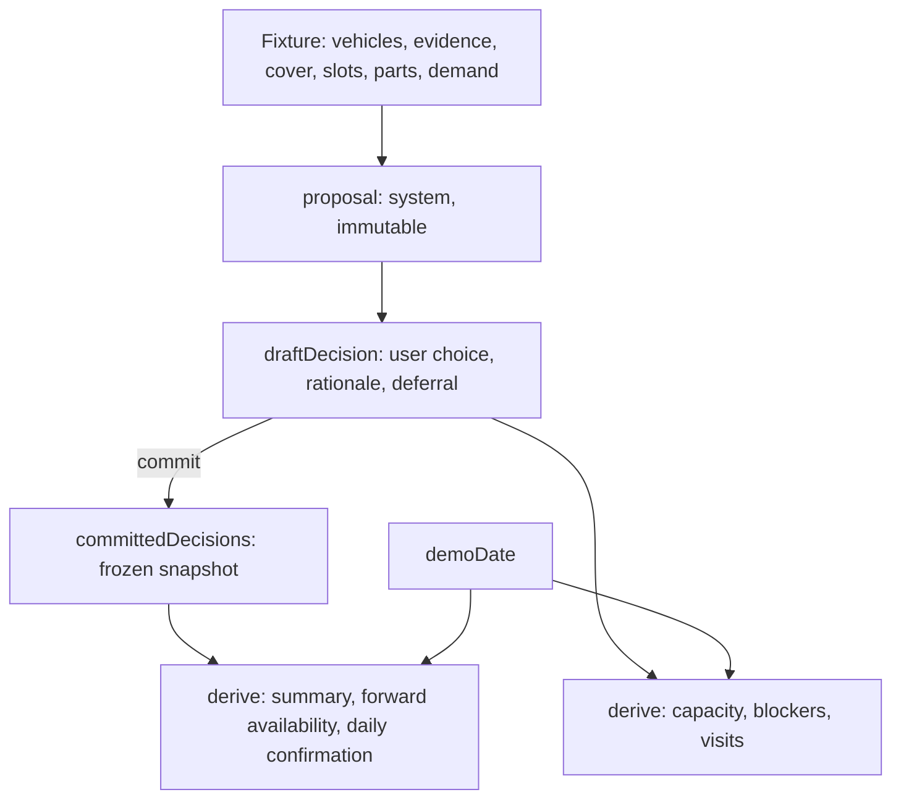

# Fleet Maintenance Prototype: Technical Design

**Date:** 2026-09-23
**Status:** Approved for implementation planning
**Supersedes nothing.** This document is the M0 gate output defined in `fleet-maintenance-work-packages.md` §3.

## 0. What this document is

`fleet-maintenance-work-packages.md` is the build contract: it fixes the user, the problem, the promise,
the goals G1 to G6, the seed scenario and the work packages E0 to E8. It is referenced throughout as
**[WP §n]** and it remains authoritative on product questions.

This document resolves the implementation questions [WP §3] leaves to the M0 gate: the stack, the state
model, the module boundaries, the concrete fixture values, the screen behaviour and the verification
approach. Where this document adds a number or a rule that [WP] does not state, it is marked **[new]**
and justified.

Nothing here changes the scope in [WP §8] or the non-goals in [WP §10].

---

## 1. Constraints locked at M0

| Constraint | Decision | Rationale |
| --- | --- | --- |
| Stack | React + TypeScript + Vite | [WP §4] requires one client-side app with fixtures and browser storage, no backend. TypeScript carries the domain model; Vite gives a fast loop and a static build. |
| Committed scope | M0 to M3 only | [WP §3]. E7 (interruption) and E5.3 (bundle versus split) stay as stated future work, walked through verbally per [WP §1]. |
| Delivery | Git repository plus a built static bundle | G6 requires a stated launch path. Covers reviewers who read code and reviewers who only want it running. |
| Verification | Vitest over the domain layer only | The ten [WP §9] scenarios are pure-function assertions once the domain is separated. No component tests at this timebox. |
| UI language | English, German domain terms verbatim | UVV, HU, Fuhrparkverantwortliche, Werkstatt kept as-is with a one-line gloss. Readable by any evaluator, and preserves the regulatory specificity the hard-stop rule depends on [WP §1.7 via F]. |
| Consequence expression | Structured statement; numbers only where the fixture grounds them | The [WP §4] recommendation contract. Avoids the false precision [WP E1] warns against and the black box [WP §10] excludes. |
| Layout | Persistent capacity band above a queue and detail split | See §6. Mockups in `docs/mockups/`. |

**State between sessions is in scope.** [WP §4] withdraws E0's original exclusion. Browser-local
persistence, a fixed demo clock and a reset control are required.

---

## 2. Architecture

### 2.1 Approaches considered

1. **Pure domain core plus a thin React shell.** All rules live in framework-free TypeScript; React
   renders and dispatches only. **Chosen.**
2. **Logic co-located in components.** Fastest to start. Produces exactly the failure [WP §4] predicts:
   "Built as separate feature models these diverge, and the divergence surfaces late, during the
   walkthrough." Capacity arithmetic would live in the band, commit validation in the header, and the
   §9 checks would require rendering.
3. **A state library (Zustand, Jotai) plus domain functions.** Same shape as (1) with a dependency
   added for a single store. No benefit at this size.

### 2.2 The governing rule: one source of truth, everything else derived

Decisions are stored. Capacity, blockers, visits, availability, the commit summary and the daily
confirmation are all **computed** from decisions. This generalises [WP §4]'s "Outputs (E8) are a
projection of committed decisions, not a second store" to the whole application.

Two properties follow without extra code:

- **Commit idempotency (G5).** Visits are derived from the decision set keyed by item ID, never
  appended to a list. Re-committing cannot duplicate a visit because nothing is ever appended. This is
  structurally impossible rather than de-duplicated after the fact.
- **No double subtraction ([WP §9]).** Daily unavailability is a `Set<VehicleId>`. A held vehicle that
  also has a booked visit appears once, by construction.

### 2.3 Three decision layers per item

[WP §4]: "The system's proposal is stored separately from the user's choice and rationale, so neither
overwrites the other."



Editing after commit mutates `draftDecision` only. The committed snapshot stays intact until recommit,
per [WP §4] "Editing leaves the last committed snapshot intact until recommit."

### 2.4 The demo clock is a parameter, never `new Date()`

Every domain function that needs a date takes `demoDate` as an argument. No module under `src/domain`
reads the system clock. This makes tests deterministic and turns "advance to the next review date" into
an ordinary state change rather than a special code path.

### 2.5 Module layout

```
src/
  domain/                  no React, no browser APIs, no Date.now()
    types.ts               Vehicle, VehicleClass, Evidence, OpenItem, Urgency, Treatment,
                           Visit, Cover, Demand, GarageSlot, Part, Decision, Deferral, Trigger,
                           Blocker, PlanWeek, CommittedPlan
    fixture.ts             the §4 seed: 45 vehicles, 5 items, cover, slots, parts, demand, 2 weeks
    clock.ts               week derivation from demoDate, odometer projection, event firing
    capacity.ts            computeCapacity(decisions, fixture, week, demoDate)
    urgency.ts             classification into the three states, plus the one-line because
    recommendation.ts      the five-part contract per item
    consequence.ts         trajectory, exposure, the three separate figures
    feasibility.ts         slot, duration and parts checks
    deferral.ts            ledger, required fields, resurfacing
    validation.ts          the commit gate, returning named blockers
    commit.ts              draft to committed snapshot, derived visits
  state/
    planReducer.ts         actions over { demoDate, draftByWeek, committedByWeek }
    persistence.ts         localStorage load, save, reset, version guard
    PlanProvider.tsx       context, useReducer, save on change
  ui/
    DemoBar.tsx            simulated label, clock, advance controls, reset, storage notice
    PlanHeader.tsx         week, commit button, blocker count and summary line
    CapacityBand.tsx       E4.1, E4.3, always visible
    DecisionQueue.tsx      E1, E2.2
    ItemCard.tsx
    ItemDetail.tsx         composes the blocks below
      EvidenceBlock.tsx    E1.1
      AssumptionBlock.tsx  E3.1
      ConsequenceBlock.tsx E3.2, E3.3
      SlotPicker.tsx       E5.1, E5.2, E4.4
      TreatmentForm.tsx    E6.1, E6.2, E6.3
    CommitSummary.tsx      E8.1, E8.2
    DailyConfirmation.tsx  E8.4, static, inside the summary
  App.tsx
  main.tsx
```

`src/domain` imports nothing from React or the browser. `src/state` owns `localStorage` and the
reducer. `src/ui` holds no rules. Every file stays small enough to hold in context at once.

---

## 3. Domain rules

### 3.1 Capacity

```
unavailable(day) = { v : v.held and not released on or before day }
                 ∪ { v : v has a visit covering day }

available(class, day) = |owned ∩ class|
                      − |unavailable(day) ∩ class|
                      + |confirmed cover compatible with class on day|

shortfall(class, day) = max(0, demand(class, day) − available(class, day))
```

Computed per day **and** per vehicle class, per [WP §4]. Cover carries its own class, so
`compatibleCover(specialist)` is empty by construction: a standard rental cannot close a specialist gap
because the data model does not permit it. Tentative availability is not modelled at all; only
confirmed cover exists.

A visit spanning N days contributes its vehicle to `unavailable(day)` for every day it covers, using
whole-day arithmetic. There is no hour-level scheduling and no routing engine [WP §5].

### 3.2 Urgency: exactly three states, never a score

| State | Meaning | Displayed as |
| --- | --- | --- |
| `deadline` | A known regulatory or contractual date exists | The date, with its source |
| `estimate` | A defensible projection with its assumption named | The projection, explicitly labelled an estimate |
| `assessment-needed` | No basis for a safe waiting window | A proposed assessment, never an invented waiting period |

Each carries a one-line *because* naming its evidence, per [WP E1] "Every urgency value needs a
one-line because that names its evidence." A safety release is never inferred from a cheaper route or a
booked appointment [WP §4].

### 3.3 The recommendation contract

Every item renders the same five parts [WP §4]:

1. Observation and its source, with the date received
2. The relevant date, **only where the fixture supplies a basis**
3. The assumption in play
4. The proposed action
5. The consequence of waiting

### 3.4 Consequence of waiting: three figures, kept apart

| Figure | Unit | Rule |
| --- | --- | --- |
| Service cost | EUR | Synthetic, labelled synthetic |
| Replacement cover | EUR | Synthetic. `€0` where confirmed cover exists on the affected days. **`not available`, never `€0`,** where no compatible cover exists **[new]** |
| Operational disruption | **Count of uncovered assignments** | Never money |

The third figure stays a count deliberately **[new]**. Converting an uncovered assignment into euros
requires a revenue-per-route figure the fixture cannot support, and [WP §4] forbids blending the three
in any case. Rendering `€0` for unavailable cover would read as free rather than impossible, which is
the opposite of the point `V-041` exists to make.

Source statistics in USD per mile are not displayed in the product at all [WP §4]. They may support the
walkthrough with source, date and applicability attached.

### 3.5 Safety hard stop

A vehicle-level hold, enforced from cold open with no interruption UI present [WP §4, §9]:

```ts
hold: { reason: string; since: ISODate; releaseRecordedOn: ISODate | null }
```

- The vehicle is in `unavailable(day)` for every day until `releaseRecordedOn <= day`.
- On an item whose vehicle is held, `bundle` and `watch` are **rendered disabled with the reason
  stated**, not hidden **[new]**. A hidden control teaches nothing; a disabled one with a reason teaches
  the rule.
- Booking a visit never sets `releaseRecordedOn`. Only the fixture records a release.
- A held vehicle is **not** a commit blocker on its own, per [WP §4]: it may stay held provided cover
  exists and a next step is recorded.

This is a chosen product rule, not a verified legal implementation [WP E7].

### 3.6 Deferral and resurfacing

```ts
Deferral = {
  reason: string          // required, non-empty after trim
  reviewDate: ISODate     // required
  trigger: Trigger        // required
}
Trigger =
  | { kind: 'odometer'; vehicleId: VehicleId; thresholdKm: number }
  | { kind: 'event'; eventId: string }
```

All three fields are required [WP E6.2, E6.3]. `Apply to draft` stays disabled while any is empty, with
the missing field named.

**Triggers fire by advancing the clock, with no cheat button [new].**

- Odometer triggers evaluate against `baselineKm + weeklyRateKm × weeksElapsed(demoDate, baselineDate)`.
- Event triggers are fixture-scheduled with a date; advancing past it fires them.

Both reduce to one user action. A "fire trigger now" button would be a demo affordance with no
real-world analogue, and would weaken the G4 evidence.

An item resurfaces when `demoDate >= reviewDate` **or** its trigger has fired. It returns carrying
`previousDecision` and the full `deferralHistory`, per [WP E6.4] and G4.

### 3.7 The plan week follows the demo clock

A consequence of §3.6. `planWeek = the Monday-to-Friday week containing demoDate`, or the next one if
`demoDate` falls on a weekend.

The fixture therefore carries **two weeks [new]**:

- **Week 40** (Mon 2026-09-28 to Fri 2026-10-02): the full seeded scenario.
- **Week 41** (Mon 2026-10-05 to Fri 2026-10-09): demand and cover only. Its queue contains **only
  resurfaced deferrals and fired triggers**. No new week 41 items exist.

**Weeks after 41 use the week 41 template [new]:** normal demand, `R-1` only, and a queue containing
only resurfaced deferrals. `V-027` reviews on 2026-11-02, which is week 45, so the clock must remain
meaningful past the two authored weeks.

This is what makes G4 demonstrable rather than asserted: commit week 40, advance to Monday, and `V-041`
returns with its rationale intact. The narrowness of week 41 is a **stated limitation in the handoff**,
not a hidden one.

### 3.8 The commit gate

`validate(draft, fixture, week, demoDate) -> Blocker[]`. Commit is permitted only when the array is
empty [WP §4].

| Blocker | Fires when | Carries |
| --- | --- | --- |
| `CapacityShortfall` | `shortfall(class, day) > 0` | day, class, shortBy, contributing vehicle IDs |
| `InfeasibleSlot` | the chosen slot is taken or the garage is closed that day | itemId, reason |
| `PartsNotReady` | the visit start date precedes the parts-ready date | itemId, partName, readyDate |

**Feasibility returns every applicable reason, not the first [new].** Monday is both garage-blocked and
parts-blocked for `V-012`, and showing only one of the two would misrepresent the constraint. The
`SlotPicker` renders all reasons on the disabled option.
| `UndisposedItem` | a required decision has no treatment | itemId |

A blocked plan is a legitimate outcome, not an error state [WP E2.5]. The draft survives, the blocker is
named, and no success state is reachable.

### 3.9 Commit semantics

- Visits are **derived** from the committed decision set, keyed by item ID. Recommitting cannot
  duplicate them (§2.2).
- The fixture **guarantees** the selected slots and confirms them atomically with the plan [WP §4].
- The UI labels the simulation. Nothing is sent anywhere. The summary never uses the language of a
  completed external booking.

---

## 4. The seed fixture

Deliberately synthetic and labelled as such in the UI [WP §5]. All prices are scenario prices in EUR.
All distances are km. The calendar is explicit and simulated.

### 4.1 Fleet and demand

- **Depot Nord**, 45 owned vans, ages 3 to 7 years, narrow model range.
- **Standard, 38:** `V-001` to `V-030`, plus `V-101`, `V-103`, `V-105`, `V-107`, `V-110`, `V-112`,
  `V-115`, `V-118`. **[new: concrete IDs, chosen so the five named vehicles fall in the right classes]**
- **Specialist, 7:** `V-039` to `V-045`.
- **Demand, every weekday:** 38 standard assignments and 7 specialist assignments. Exactly the fleet
  size, so there is no slack by construction [WP A1 via F].
- Every vehicle carries `odometerKm`, `odometerReadOn` and `weeklyRateKm`, which is what odometer
  triggers project against (§3.6). The five named vehicles have explicit values; the remaining 40 share a
  depot default of 480 km per week. **[new]**

### 4.2 Confirmed cover

| ID | Class | Confirmed | Day rate (synthetic) |
| --- | --- | --- | --- |
| `R-1` | standard | Week 40 Mon to Fri; week 41 Mon to Fri | €140 |
| `R-2` | standard | Week 40 **Tue and Thu only** | €140 |
| none | specialist | No specialist cover exists in either week | n/a |

Both are pre-approved and below threshold [WP A7 via F]. No rental-purchasing UI exists.

### 4.3 Garage slots, Werkstatt Berg, whole-day bays

| Day | Free bays |
| --- | --- |
| Mon 2026-09-28 | **0, fully booked** |
| Tue 2026-09-29 | 3 |
| Wed 2026-09-30 | 1 |
| Thu 2026-10-01 | 2 |
| Fri 2026-10-02 | 2 |

**[new, and load-bearing.]** These counts are chosen so that the cold-open proposal exactly fills
Tuesday (3 of 3), so that moving `V-118` to Thursday is possible, so that `V-041` always has a free bay
available (isolating its blocker to specialist capacity rather than the garage), and so that Monday
demonstrates a genuine `InfeasibleSlot`.

### 4.4 The five decisions

#### `V-012`, standard, safety class, hard stop

| Field | Value |
| --- | --- |
| Item | Brake defect found at UVV inspection |
| Evidence | UVV-Prüfbericht, 2026-09-25: front axle brake pads below wear limit, finding recorded as *verkehrsunsicher* |
| Urgency | `deadline`. UVV requires immediate removal from service |
| Hold | Held since 2026-09-25. `releaseRecordedOn: 2026-10-01`, recorded by the fixture after repair sign-off |
| Proposal | Act now. Werkstatt Berg, Tue 2026-09-29, 1 day |
| Parts | Brake pads, ready **2026-09-29**. Monday is parts-blocked as well as garage-blocked |
| Treatments | `bundle` and `watch` disabled, reason stated |
| Figures | Service €480. Cover €700 (5 days of `R-1`). Disruption: 0 uncovered |

Held at cold open, before any commit and with no interruption UI [WP §9, first row].

#### `V-103`, standard, act now

| Field | Value |
| --- | --- |
| Item | Front suspension wear, contradicting the odometer interval |
| Evidence | Workshop inspection 2026-09-22: front lower control arm bushings worn. Odometer 61,400 km; interval due at 70,000 km |
| Urgency | `estimate`. Assumption: the urban duty cycle accelerates bushing wear, so the inspection finding overrides the odometer interval |
| Proposal | Act now. Werkstatt Berg, Tue 2026-09-29, 1 day. **Scope can extend to a second day** |
| Parts | Bushing set, ready 2026-09-25 |
| Figures | Service €620. Cover €140. Disruption: 0 uncovered |

The scope extension to Tue and Wed is the multi-day arithmetic check [WP §5], retained as a test even
though E7 is out of scope.

#### `V-118`, standard, act now or move

| Field | Value |
| --- | --- |
| Item | Service interval approaching |
| Evidence | Telematics odometer 47,820 km, read 2026-09-18 06:12. Interval at 50,000 km |
| Urgency | `estimate`. Assumption: weekly mileage holds at the trailing 8-week average of **560 km**, so the interval is reached around **2026-10-15**. Not a predicted failure date |
| Proposal | Act now. Werkstatt Berg, Tue 2026-09-29, 1 day |
| Alternatives | Thu 2026-10-01 (clears the shortfall); Wed 2026-09-30 (**moves** the shortfall to Wednesday); Mon 2026-09-28 (garage fully booked, disabled) |
| Parts | Service kit, ready 2026-09-24 |
| Figures | Service €340. Cover €140. Disruption: depends on the chosen day |
| If deferred | Odometer trigger at 49,500 km, reached 2026-10-09 on the stated rate |

The Wednesday option is deliberate **[new]**. It demonstrates [WP E4.4]'s "staggering alone does not
create capacity": moving a visit relocates a shortage rather than resolving it.

#### `V-041`, **specialist**, the unsolvable conflict

| Field | Value |
| --- | --- |
| Item | Intermittent fault code, cleared twice |
| Evidence | DTC P0300, random misfire, logged 2026-09-08 and 2026-09-17, cleared both times. No drivability complaint from the driver |
| Urgency | `assessment-needed`. The code has recurred, but there is no measured trend and no deadline, so no safe waiting period can be stated |
| Proposal | Diagnostic visit. **Arrives undisposed**, with no slot chosen |
| Parts | None. Diagnostic only |
| Figures | Diagnostic €180. Cover **not available**. Disruption: 1 specialist assignment uncovered |
| Deferral | Legitimately available: not safety class. Review date 2026-10-05. Trigger: event `v041-dtc-recurs`, fixture-scheduled 2026-10-07 |

**Arriving undisposed is a deliberate design decision [new].** If the proposal pre-scheduled the visit,
the cold open would carry two capacity shortfalls at once and bury the lesson. Undisposed, `V-041` is an
`UndisposedItem` blocker at cold open; the **specialist** shortfall appears only when the user tries to
schedule it, which is the moment it teaches something. The aggregate count looks healthy throughout.

#### `V-027`, standard, the defensible deferral

| Field | Value |
| --- | --- |
| Item | Wiper linkage noise reported by driver |
| Evidence | Driver report 2026-09-21, verbatim: *"Scheibenwischer macht beim Einschalten ein knackendes Geräusch, wischt aber sauber."* UVV inspection clean 2026-09-11. Weekly mileage 210 km. Next scheduled service 2026-11-02 |
| Urgency | `estimate`. Assumption: linkage noise without degraded wipe performance is not a safety defect, so the evidence supports waiting until the scheduled service |
| Proposal | **Watch.** Review date 2026-11-02. Trigger: event `v027-wipe-degrades`, **never scheduled to fire in the fixture** |
| Figures | Service €95 if bundled at the November service. Cover €0. Disruption: 0 |

Nothing in the fixture overturns this deferral. G2 requires the fixture to argue both ways [WP E0], and
this is the side that stays defensible. Service is never forced merely to clear the queue.

### 4.5 The arithmetic, verified

Cold open, after the system proposals and before any user action:

| Day | Standard available | Demand | Result |
| --- | --- | --- | --- |
| Mon 28 Sep | 38 − \|{V-012}\| + R-1 = 38 | 38 | met |
| **Tue 29 Sep** | 38 − \|{V-012, V-103, V-118}\| + R-1 + R-2 = **37** | 38 | **short 1** |
| Wed 30 Sep | 38 − \|{V-012}\| + R-1 = 38 | 38 | met |
| Thu 1 Oct | 38 − \|{V-012}\| + R-1 + R-2 = 39 | 38 | 1 spare |
| Fri 2 Oct | 38 − \|{V-012}\| + R-1 = 38 | 38 | met |

Specialist is 7 against 7 on every day, because `V-041` is undisposed.

`V-012` is already held, so its Tuesday visit subtracts nothing further. This is the
never-count-a-vehicle-twice check.

**Moving `V-118` to Thursday** returns Tuesday to `38 − |{V-012, V-103}| + 2 = 38` and takes Thursday to
`38 − |{V-012, V-118}| + 2 = 38`. Both met, and the week commits.

**Moving `V-118` to Wednesday** instead gives `38 − |{V-012, V-118}| + R-1 = 37` against 38, because
`R-2` does not cover Wednesday. The shortage relocates.

**Scheduling `V-041` on any day** gives specialist `7 − 1 + 0 = 6` against 7. No lever closes it.

**Extending `V-103` to Tue and Wed** gives Wednesday `38 − |{V-012, V-103}| + R-1 = 37` against 38.

All figures match [WP §5].

---

## 5. State and persistence

### 5.1 Shape

```ts
AppState = {
  version: 1
  demoDate: ISODate
  draftByWeek: Record<WeekId, Record<ItemId, DraftDecision>>
  committedByWeek: Record<WeekId, CommittedPlan | null>
  deferralHistory: Record<ItemId, DeferralRecord[]>
}
```

Exactly one draft and one committed snapshot per week [WP §4]. Everything else is derived.

### 5.2 Persistence

- Key `fleet-maintenance-prototype/v1`, `localStorage`.
- Saved on every state change. The state is small; no debounce is warranted.
- **Version guard and error handling.** Load is wrapped: a parse failure, a missing `version`, or a
  version mismatch falls back to the seed and surfaces a one-line notice in the demo bar. It never
  fails silently and never crashes the app.
- Reset clears the key, restores the seed and restores the demo date to 2026-09-28.
- Refresh restores browser-local state; reset restores the deterministic seed [WP §4].

### 5.3 Operational note

There is no network and no async I/O anywhere in the application. That removes request failures,
timeouts, race conditions and unhandled rejections as a class, rather than requiring them to be handled.
No credentials of any kind exist in this codebase.

---

## 6. The surface

### 6.1 Layout

Committed: **persistent capacity band above a queue and detail split**. Mockups:
`docs/mockups/layout-b-capacity-band.mockup.html` (chosen) and
`docs/mockups/layout-a-split-pane.mockup.html` (rejected).

The alternative put the detail panel over the capacity view. It was rejected because [WP E4.2] requires
booking-as-subtraction to be shown **in place**, and that layout hides capacity during the only
interaction that changes it.

Day filtering from the band was considered and cut as unnecessary.

### 6.2 One screen, three states below the band

The demo bar and capacity band are always present. Beneath them the surface is:

1. **Planning.** Decision queue on the left, item detail on the right.
2. **Summary.** Replaces the queue and detail after a successful commit. `Edit plan` returns to
   planning. No copying occurs: the draft already equals what was committed, and the committed snapshot
   stays frozen until recommit.
3. The **daily confirmation** (E8.4) is a static section inside the summary, not a view of its own,
   because it is a read-only projection of committed decisions.

This satisfies [WP §3]'s one-screen-plus-detail requirement while giving the summary room.

### 6.3 Components and their package mapping

| Component | Packages | Shows |
| --- | --- | --- |
| `DemoBar` | E0.3 | `SIMULATED` label, demo clock, advance one day, advance to next review date (disabled when none is pending), reset, storage notice |
| `PlanHeader` | E2.1, E2.5 | Week, depot, fleet size, commit button, blocker count and lead blocker |
| `CapacityBand` | E4.1, E4.3 | Five days, two class rows, available over demand, shortfall and spare flagged, cover summary, contributor line |
| `DecisionQueue` | E1, E2.2 | Five items, ordered per §6.5 |
| `ItemCard` | E1.3, E1.4 | ID, class and safety badges, title, urgency chip, the one-line because, current disposition |
| `EvidenceBlock` | E1.1 | Observation, source, date received, verbatim driver wording where applicable |
| `AssumptionBlock` | E3.1 | The assumption in play and the projection it supports, labelled an estimate |
| `ConsequenceBlock` | E3.2, E3.3 | Qualitative consequence plus the three separate figures, `SYNTHETIC PRICES` labelled |
| `SlotPicker` | E5.1, E5.2, E4.4 | Available slots with their capacity effect; infeasible slots disabled **with the reason shown** |
| `TreatmentForm` | E6.1, E6.2, E6.3 | Act now, bundle, watch. Rationale, review date and trigger, all required |
| `CommitSummary` | E8.1, E8.2 | Confirmed simulated visits, forward availability, cover assumptions, deferred follow-ups |
| `DailyConfirmation` | E8.4 | Static: which vans roll tomorrow, which are off the road and why |

### 6.4 Queue ordering

G1 turns on what the queue puts first, so the order is fixed rather than left to urgency alone **[new]**:

1. Safety class and `deadline` urgency
2. Items currently contributing to a blocker, blocking item first
3. Everything else by urgency: `deadline`, then `estimate`, then `assessment-needed`
4. Items already disposed, last

At cold open this yields `V-012`, `V-118`, `V-041`, `V-103`, `V-027`. `V-041` ranks third despite
`assessment-needed` urgency because it is an `UndisposedItem` blocker, which is the behaviour G1 wants:
the queue surfaces what stops the week, not just what is urgent.

### 6.5 Failure behaviour is never a dialog

- A blocked plan keeps its draft, names the blocker inline, and disables commit with the count beside
  it. No modal, no toast, no data loss.
- Infeasible slots are rendered **disabled with their reason**, not omitted, so the constraint is
  legible.
- Incomplete deferral fields disable `Apply to draft` and name the missing field.
- Corrupt or version-mismatched storage falls back to the seed and says so (§5.2).

---

## 7. Verification

### 7.1 Automated

Vitest over `src/domain` only. No component tests. The ten [WP §9] scenarios map one to one:

| # | Scenario | Assertion |
| --- | --- | --- |
| 1 | Safety issue at cold open | `V-012` unavailable before any commit; `bundle` and `watch` unavailable with a reason; holds with no interruption UI in the tree |
| 2 | Justified routine deferral | `V-027` records reason, review date and trigger; no forced service |
| 3 | Tight day with a feasible alternative | Moving `V-118` to Thursday clears the shortfall and unblocks commit |
| 4 | Aggregate hides a specialist gap | Scheduling `V-041` yields specialist shortfall 1; standard cover does not erase it |
| 5 | Multi-day visit overlaps a hold | `V-103` extended to Tue and Wed: every day counts, each vehicle once, Wednesday short 1 |
| 6 | Slot or part unavailable | Monday is `InfeasibleSlot` for `V-118` and `PartsNotReady` for `V-012`; neither becomes a confirmed visit |
| 7 | Evidence insufficient | `V-041` classifies `assessment-needed`; no waiting period is produced |
| 8 | Review date or trigger | Advancing to 2026-10-05 resurfaces `V-041` with prior decision and rationale intact |
| 9 | No feasible plan | With `V-041` scheduled, the draft persists, the shortage is visible, commit stays unreachable |
| 10 | Commit, edit, recommit, reload, reset | Summary matches committed decisions; no duplicate visits; state and reset behave per §5 |

Plus a direct test of §2.2's idempotency property and §3.1's set-based deduplication.

### 7.2 Manual

G1 and G5 are usability targets. **The walkthrough will be self-run**, and [WP §2] is explicit that a
self-run walkthrough is recorded as a self-run walkthrough, not as an observed one. `docs/acceptance.md`
records this limitation against G1 and G5 rather than claiming an observed result.

### 7.3 The walkthrough script, which is also the demo

1. Cold open: five items, two named blockers, `V-012` already held before anything is committed
2. Open `V-118`; Tuesday is red because of it; switch the slot to Thursday; Tuesday clears in the band
3. Open `V-041`; schedule it; the **specialist** row breaks while the aggregate still reads healthy; no
   lever closes it
4. Defer `V-041` with reason, review date and trigger; the second blocker clears
5. Accept the proposed watch on `V-027`; confirm `bundle` and `watch` are disabled on `V-012` with the
   reason shown
6. Commit; the summary carries visits, forward availability, cover assumptions and deferred follow-ups
7. Advance the clock to Monday 2026-10-05; `V-041` resurfaces with its rationale intact; reset

Target: roughly five minutes (G5).

### 7.4 Acceptance artefact

`docs/acceptance.md` records G1 to G6 as **passed, failed or not run**, with any remaining limitation
stated, alongside the §7.1 results. A goal with no evidence is recorded as not run.

---

## 8. Delivery

- `git init` in the project root; this folder is not yet a repository.
- `npm install`, then `npm run dev` to run and `npm run build` to produce a static `dist/`.
- `README.md` carrying G6: the launch path, what is simulated, the limitations, the decisions taken,
  the alternatives rejected, and the next step.

Stated limitations to carry into the README:

1. Week 41 contains only resurfaced items (§3.7).
2. The walkthrough is self-run, not observed (§7.2).
3. Commit is simulated and fixture-guaranteed. Real-world rejection and pending confirmation are future
   work [WP §4, §10].
4. The safety hard stop is a chosen product rule, not a verified legal implementation [WP E7].
5. Prices are scenario prices, not market data.

---

## 9. Explicitly not built

Unchanged from [WP §8] and [WP §10]. Restated for the implementation plan:

**Deferred, and not in this spec:** E7 interruption entry; E5.3 bundle versus split; interactive daily
dispatch; more than one event type; general signal processing; detailed future-cost modelling;
generated messages; expanded garage choice; E8.3 driver drop-off and outcome routing.

**Outside the prototype entirely:** quote and approval; MD-facing UI; closure and compliance
documentation; driver app; garage portal; real bookings, messages or integrations; rental sourcing;
predictive failure modelling and ML; route optimisation; cost analytics; multi-depot; onboarding; admin.

---

## 10. Open items carried forward

Resolved by this document: stack, state model, module boundaries, concrete fixture values, layout,
persistence mechanics, trigger mechanism, the plan-week model, the verification approach.

Still open, and resolvable only by building or by the walkthrough:

- **E3 depth** [WP §11]. The failure band is narrow: too shallow reads as a guess, too elaborate reads
  as a black box. §3.4 fixes the *form*; whether the depth lands is a question for M2.
- **Whether estimate-class urgency reads as credible** to someone who was not in these conversations.
  Only a walkthrough answers this, and §7.2 notes that the walkthrough will be self-run.
- **Attribution for any statistic carried into the presentation** [WP §11]. Source, date and
  applicability attached, or the precision dropped. The US-to-Germany and zero-spare caveats stay
  attached. A working prototype shows the journey holds together, and nothing more.
